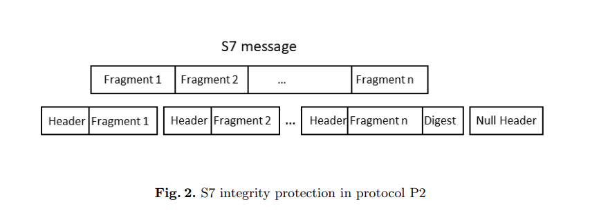

# S7

Giao thức S7 sẽ hoạt động dựa trên giao thức [COTP](cotp.md)/[ITOT](itot.md) và TCP/IP với port mặc định là 102.

Chế độ giao tiếp của S7 là client-server: TIA Portal (Totally Integrated Automation Portal) hoặc HMI (Human Machine Interface) đóng vai trò như là client, còn PLC (Programmable Logic Controller) đóng vai trò như là server nhằm trả về dữ liệu hoặc thực hiện các lệnh được gửi từ client.

Một số thao tác có thể thực hiện qua giao thức S7:
- Chạy/dừng chương trình người dùng (user program)
- Tải user program vào PLC
- Nạp user program từ PLC
- Đọc/ghi dữ liệu vào các biến của PLC

<!-- Tất cả các gói tin của S7 đều cần phải được gửi thông qua một session. Mỗi session có một session ID (được chọn bởi PLC). Một session được bắt đầu bằng 4 gói tin bắt tay nhằm xác định các tùy chọn mã hóa, bao gồm phiên bản của giao thức và các khóa. Tất cả các gói tin sau quá trình handshake đều được đảm bảo tính toàn vẹn. -->

## S7 Communication Plus Protocol

Có hai phiên bản của giao thức S7 là S7 Communication và S7 Communication Plus. Gói tin của giao thức S7 Communication Plus có 3 phần:
- Header
- Data
- Trailer

Header và trailer có cấu trúc và giá trị giống nhau, bao gồm các trường:
- Protocol ID (1b): 0x72 đối với S7 Communication Plus (0x32 đối với S7 Communication).
- Protocol version (PDU Type) (1b): 0x1 (connect), 0x2 (data) và 0x3 (func). Đối với 0x3 thì sẽ phần data sẽ có thêm integrity.
- Data length (2b): kích thước của data.

Data được chia ra thành các phần như sau:

Các thông điệp của giao thức S7 có thể được phân mảnh thành các gói nhỏ hơn gọi là các phân mảnh (fragment), đặc biệt là trong trường hợp thực hiện các thao tác cần trao đổi nhiều dữ liệu chẳng hạn như download/upload user program. 

## Cryptographic Protection

Cơ chế mã hóa của giao thức S7 bao gồm các thành phần sau:
1. Giao thức trao đổi khóa (session key) giữa TIA Portal và PLC.
2. Thuật toán đảm bảo tính toàn vẹn bằng cách tính MAC (Message Authentication Code).
3. Thuật toán mã hóa payload.

### Message authentication and integrity protection

Sau quá trình handshake, các thông điệp sẽ được tính MAC bằng cách dùng session key và thuật toán HMAC-SHA256. 

Giao thức S7 Communication Plus còn được chia ra 2 phiên bản nhỏ hơn nữa. Phiên bản đầu tiên (gọi là P2), đặt MAC ở sau fragment cuối cùng của thông điệp:

Do đặt MAC ở fragment cuối cùng nên chỉ khi nhận được fragment này thì PLC mới có thể kiểm tra tính toàn vẹn của thông điệp.

Phiên bản thứ hai (gọi là P3), đặt MAC sau header của từng gói tin:

Để tính MAC, TIA Portal và PLC sử dụng HMAC-SHA256 API bao gồm 3 hàm: `init`, `update` và `finalize`. Cách sử dụng điển hình của các hàm này là:
- `init`: khởi tạo cấu trúc context, chứa các thông tin được dùng trong quá trình băm chẳng hạn như số bit đã băm [^1].
- `update`: được gọi nhiều lần cho từng fragment để cập nhật context.
- `finalize`: được gọi duy nhất một lần sau khi update xong fragment cuối cùng để lấy ra MAC. Hàm này sẽ làm thay đổi context.

Thiết kế của những hàm này không cho phép gọi `finalize` nhiều lần cho cùng một thông điệp hoặc gọi `finalize` xen kẽ với `update`.

Tuy nhiên, giá trị MAC được tính bởi TIA Portal bằng cách xen kẽ giữa `update` và `finalize` trong khi hiện thực mà TIA Portal sử dụng lại là phiên bản gọi `finalize` một lần duy nhất. Dẫn đến, tất cả các giá trị băm ngoại trừ giá trị đầu tiên đều không chính xác do `finalize` đã thay đổi context.

### Key Establishment

Giao thức P2 sử dụng một chuỗi các khóa cố định. Khi quá trình handshake xảy ra, khóa tiếp theo sẽ được tính toán bởi TIA Portal và PLC. Các khóa này và thứ tự của chúng là cố định. Hơn thế nữa, chuỗi các key này là không đổi khi khởi động lại TIA Portal hoặc dùng một instance khác của TIA Portal.

Trong giao thức P3, Siemens dùng giao thức challenge-response mà sử dụng ECC để trao đổi khóa.

Quy trình four-message handshake:

Phiên bản của firmware trong thông điệp M2 sẽ giúp TIA Portal xác định khóa công khai. Khi nhận được M2, TIA Portal sẽ sinh session key dựa trên một KDK (key derivation key) được chọn ngẫu nhiên và challenge từ PLC.

M3 gửi đến PLC sẽ bao gồm:
- KDK đã được mã hóa bằng khóa công khai của PLC kèm theo một số metadata khác. PLC sẽ giải mã KDK và sử dụng nó để sinh session key.
- 8 byte key fingerprint của PLC public key ID và KDK.

Nếu PLC xác thực M3 thành công thì nó sẽ gửi gói M4.

Tất cả các thông điệp sau đó sẽ được bảo vệ bởi session key.

## Key exchange vulnerabilities and implications

Một số lỗ hổng:
- PLC không xác thực TIA Portal do nó chỉ giải mã KDK và sinh ra session key mà không quan tâm KDK đó đến từ đâu. 
- Các PLC chạy cùng một firmware sẽ có cùng chuỗi khóa công khai và do đó mà chúng có thể giả dạng lẫn nhau.

Refs: 
- https://i.blackhat.com/USA-19/Thursday/us-19-Bitan-Rogue7-Rogue-Engineering-Station-Attacks-On-S7-Simatic-PLCs-wp.pdf
- https://blog.viettelcybersecurity.com/security-wall-of-s7commplus-part-1/

[^1]: https://sacworkshop.org/SAC20/files/preproceedings/16-Unintended.pdf