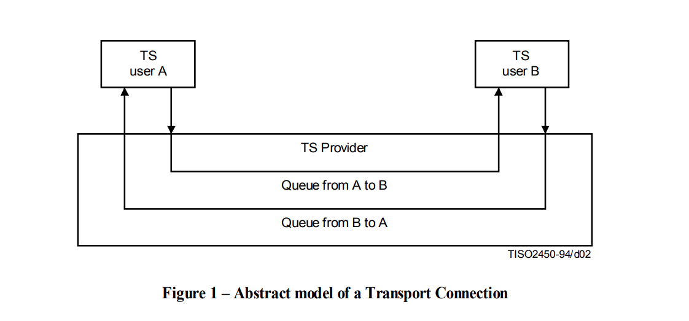
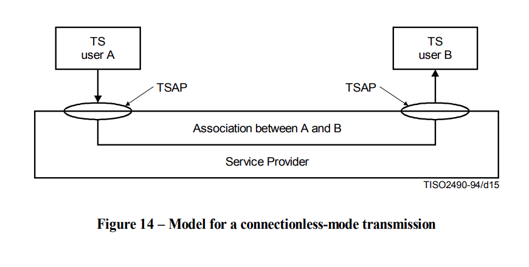

# ISO Transport Service (ISO 8072, X.214)

## TL;DR

ISO transport service (TS) giúp định nghĩa các dịch vụ được cung cấp bởi các giao thức ở tầng vận chuyển của ISO (ISO transport layer protocol) chẳng hạn như TP0, TP1, TP2, ... trong bộ giao thức của ISO.

Transport service access point (TSAP) là một giao diện giữa các giao thức ở tầng vận chuyển của ISO với các ứng dụng. Nói cách khác, TSAP cung cấp cho các ứng dụng cách thức truy cập đến các dịch vụ của TCP/IP.

Tổng quát hơn, TSAP đóng vai trò như là định danh cho điểm truy cập đầu cuối (endpoint identifier). Địa chỉ của TSAP interface là địa chỉ của tài nguyên tại một vị trí cụ thể nào đó. Có thể nói, địa chỉ TSAP giống với port của giao thức TCP.

Bằng cách sử dụng địa chỉ TSAP, các gói tin có thể được điều hướng đến đúng tiến trình ở trong host.

> The TSAP (Transport Service Access Point) functions as the address of the resource (a Level 4 address in the ISO 7 layer reference model).

> In SIMATIC S7, the TSAP is made up of two parts: A "connection resource" ID and a specified location (rack/slot in S7 stations) or an internal system ID (PC stations).

Ref: https://support.industry.siemens.com/forum/vn/en/postattachments/download/?attachmentId=25458

## Introduction


Transport connection (TC) là một kết nối được thiết lập bởi tầng vận chuyển, hay còn gọi là bên cung cấp dịch vụ vận chuyển - transport service provider, với 2 người dùng dịch vụ vận chuyển (TS user) ở tầng trên để vận chuyển dữ liệu.

Có hai loại dịch vụ vận chuyển:
- Cần thiết lập kết nối
- Không thiết lập kết nối

## Connection-mode service

Dữ liệu được truyền giữa một TS user và một TS provider bởi các primitive. Các primitive này là dạng biểu diễn trừu tượng của các loại thao tác trong một TC giữa 2 TSAP và có thể chứa các tham số.

Ngoài ra, một TC sẽ bao gồm một cặp hàng đợi kết nối hai TSAP, mỗi hàng đợi tương ứng với một chiều vận chuyển dữ liệu.



Các đối tượng được thêm vào và loại bỏ khỏi hàng đợi dựa trên các thao tác ở 2 TSAP.

### Primitives

Mỗi primitive sẽ tương ứng với một loại đối tượng cụ thể.

Các loại đối tượng có thể được thêm vào hàng đợi bởi một TS user:
- Kết nối (connection)
- Các octer chứa dữ liệu thông thường
- Dấu hiệu cho biết kết thúc của TSDU (Transport Service Data Unit)
- Các TSDU ưu tiên
- Ngắt kết nối (disconnect)

Loại đối tượng duy nhất mà có thể được thêm vào một hàng đợi bởi TS provider là ngắt kết nối.

Danh sách các primitive:

```txt
+-------------------+----------------------+-----------------------+----------------------------------------------------------+
|      Phase        |        Service       |        Primitive      |                       Parameters                         |
+-------------------+----------------------+-----------------------+----------------------------------------------------------+
| TC establishment  | TC establishment     | T-CONNECT request     | (Called address, calling address, expedited data option, |
|                   |                      |                       | quality of service, TS user-data)                        |
|                   |                      | T-CONNECT indication  | (Called address, calling address, expedited data option, |
|                   |                      |                       | quality of service, TS user-data)                        |
|                   |                      | T-CONNECT response    | (Quality of service, responding address, expedited data  |
|                   |                      |                       | option, TS user-data)                                    |
|                   |                      | T-CONNECT confirm     | (Quality of service, responding address, expedited data  |
|                   |                      |                       | option, TS user-data)                                    |
+-------------------+----------------------+-----------------------+----------------------------------------------------------+
| Data transfer     | Normal data transfer | T-DATA request        | (TS user-data)                                           |
|                   |                      | T-DATA indication     | (TS user-data)                                           |
|                   | Expedited data       | T-EXPEDITED-DATA      | (TS user-data)                                           |
|                   | transfer             | request               |                                                          |
|                   |                      | T-EXPEDITED-DATA      | (TS user-data)                                           |
|                   |                      | indication            |                                                          |
+-------------------+----------------------+-----------------------+----------------------------------------------------------+
| TC release        | TC release           | T-DISCONNECT request  | (TS user-data)                                           |
|                   |                      | T-DISCONNECT          | (Disconnect reason, TS user-data)                        |
|                   |                      | indication            |                                                          |
+-------------------+----------------------+-----------------------+----------------------------------------------------------+
```

Một TS user A mà khởi tạo việc thiết lập kết nối bằng cách thêm một đối tượng kết nối (đại diện cho một T-CONNECT request primitive) vào hàng đợi từ A đến B, không được phép thêm bất kỳ đối tượng nào khác ngoài một đối tượng ngắt kết nối vào hàng đợi này cho đến sau khi đối tượng kết nối đại diện cho T-CONNECT confirm đã được loại bỏ. 

Trong hàng đợi từ TS user B đến TS user A, các đối tượng khác ngoài một đối tượng ngắt kết nối có thể được thêm vào bởi TS user B chỉ sau khi TS user B đã thêm vào một đối tượng kết nối tương ứng với một T-CONNECT response. Việc thêm vào một đối tượng ngắt kết nối đồng nghĩa với việc khởi tạo quy trình giải phóng.

### Precedence of Objects in the Queue

TS provider có thể chỉnh sửa các cặp đối tượng liền kề trong hàng đợi để sắp xếp lại và xóa dựa trên các điều kiện cụ thể:
- (g) Sắp xếp lại: Thứ tự của hai đối tượng có thể bị đảo ngược nếu **đối tượng thứ hai ưu tiên hơn đối tượng thứ nhất**. Expedited TSDUs (Transport Service Data Units) ưu tiên hơn các octet dữ liệu bình thường và end-of-TSDU indications.
- (h) Xóa: **đối tượng ngắt kết nối ưu tiên hơn tất cả các đối tượng khác**. Bất kỳ đối tượng nào cũng có thể bị xóa nếu theo sau bởi một đối tượng ngắt kết nối. Nếu một đối tượng kết nối liên quan đến một T-CONNECT request bị xóa, đối tượng ngắt kết nối cũng bị xóa. Tuy nhiên, nếu một đối tượng kết nối liên quan đến một T-CONNECT response bị xóa, đối tượng ngắt kết nối không bị xóa.

Bảng ưu tiên:

```txt
+--------------------------------------------------------------------------------------------+
| The queue object x  | Connect   | Octets of   | End-of-TSDU  | Expedited   | Disconnect    |
|                     | object    | normal data | indication   | TSDU        | object        |
|                                                                                            |
|has precedence                                                                              |
|over queue object y                                                                         |
+--------------------------------------------------------------------------------------------+
| Connect object      |    -      |     No      |      -       |     No       | Yes [see (h)]|
+--------------------------------------------------------------------------------------------+
| Octets of normal    |    -      |     No      |     No       | Yes [see (g)]| Yes [see (h)]|
| data                                                                                       |
+--------------------------------------------------------------------------------------------+
| End-of-TSDU         |    -      |     No      |     No       | Yes [see (g)]| Yes [see (h)]|
| indication                                                                                 |
+--------------------------------------------------------------------------------------------+
| Expedited TSDU      |    -      |     No      |     No       |     No       | Yes [see (h)]|
+--------------------------------------------------------------------------------------------+
| Disconnect object   |    -      |      -      |      -       |      -       | No [see (h)] |
+--------------------------------------------------------------------------------------------+
```

Với:
- `–` có nghĩa là không áp dụng.
- `No` có nghĩa là không có ưu tiên.
- `Yes` có nghĩa là có ưu tiên.

## Connectionless-mode service

Các gói tin được truyền từ TSAP nguồn đến TSAP đích **mà không cần thiết lập trước kết nối hoặc giải phóng kết nối sau đó**. Chế độ này có thể được mô hình hóa ở dạng trừu tượng như một **liên kết cố định** giữa hai TSAP.



Việc gửi gói tin không cần thiết lập kết nối chỉ có thể diễn ra khi các TS user tồn tại và được biết đến bởi TS provider.

Ref: https://www.itu.int/rec/T-REC-X.214/en