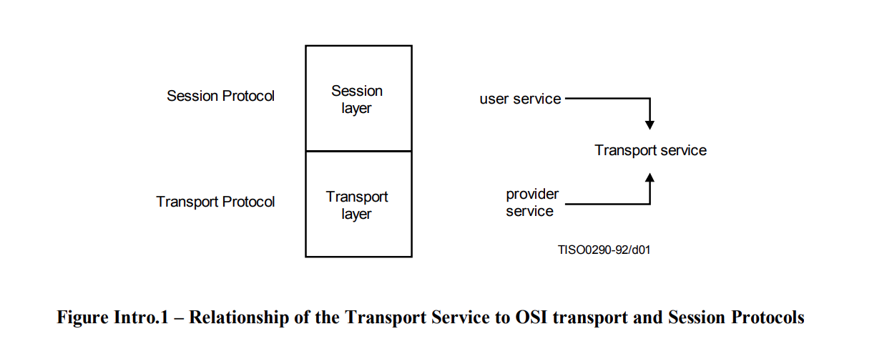

# Transport Service Access Point (TSAP)

## Intro

The term "Service" refers to the abstract capability provided by one layer of the OSI Reference Model to the layer above it.

Transport connection (TC): an association established by a Transport Layer between two TS (transport service) users for the transfer of data.

There are two types of Transport Service:
- a connection-mode service
- a connectionless-mode service

## Connection-mode service

The model defines the interactions between the TS users and the TS provider which take place at the two TSAPs. Information is passed between a TS user and the TS provider by service **primitives**, which may convey **parameters**. 

The primitives are abstract representations of TSAP interactions. They are solely descriptive and do not represent a specification for implementation.

The operation of a TC is modelled in an abstract way by a **pair of queues** linking the two TSAPs. There is one queue for
each direction of information flow. 

Objects are entered and removed from the queue as a result of interactions at the two TSAPs.

The objects which may be placed in a queue by a **TS user**:
- connect objects  (representing all parameters contained in a T-CONNECT request or T-CONNECT response primitive)
- octets of normal data
- indications of end-of-TSDU
- expedited TSDUs
- disconnect objects (representing T-DISCONNECT primitives and their parameters)

The only objects which can be placed in a queue by the **TS provider** are disconnect objects.

TS user A, who initiates connection establishment by entering a connect object (representing a T-CONNECT request primitive) into the queue from A to B, is not allowed to enter any other object than a disconnect object into this queue until after the connect object representing the T-CONNECT confirm has been removed. In the queue from TS user B to TS user A, objects other than a disconnect object can be entered by TS user B only after TS user B has entered a connect object corresponding to a T-CONNECT response. The insertion of a disconnect object represents the initiation of the release procedure.